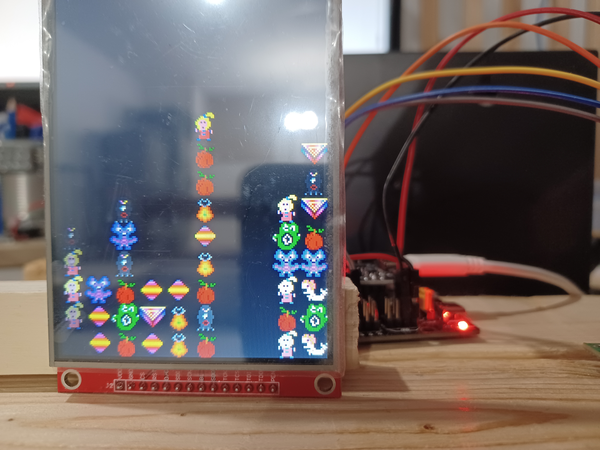
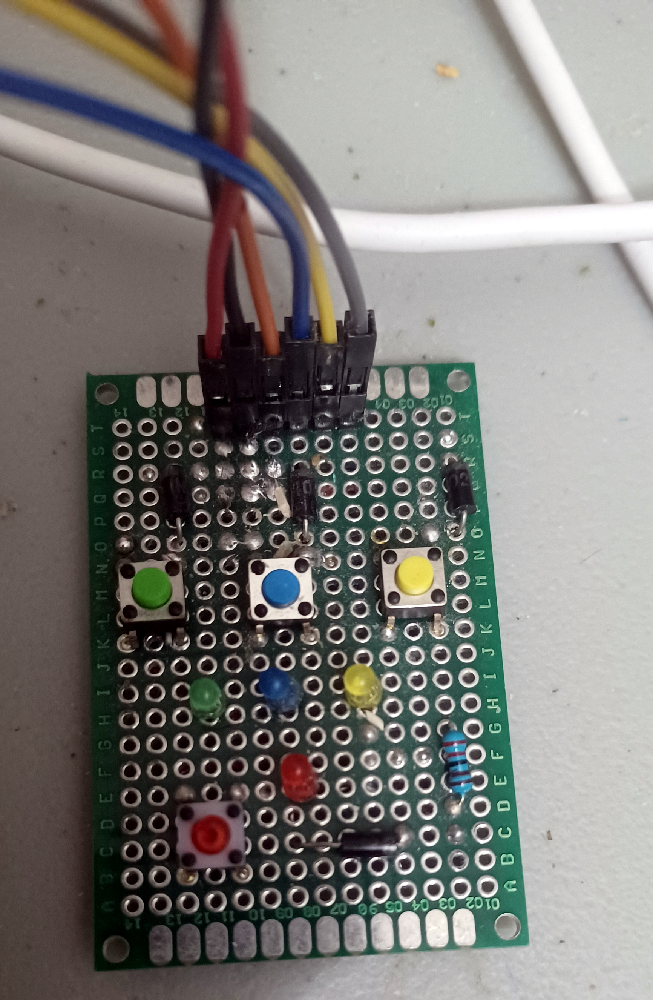

# About

This project is a game port to ESP-32 microcontroller of an old Windows 3.1 Game.

Current status is alpha. 90% of the core mechanic has been implemented.

## ESP-32 IL9488/SPI



I am also releasing the source code for the mcxz compiler:
https://github.com/cfrankb/cs3-map-edit/tree/master/tools/mcxz

# Software required

esp-idf v5.1.2 or later.

# Installation

This project is based in part on: https://github.com/anuprao/esp32_ili9488/

```Shell
git clone https://github.com/cfrankb/esp32-ili9488-jewel.git
cd esp32-ili9488-jewel/
idf.py set-target {esp32/esp32s2/esp32s3/esp32c3}
idf.py menuconfig
idf.py flash
```

# Tested with this hardware

| Driver  | Resolution | Max SPI Freq | Display Inv |
| ------- | ---------- | ------------ | ----------- |
| ILI9488 | 320x480    | 40M          | False       |

## ILI9488

These are settings example which apply to the ESP32.
GPIO pins for other models may vary. Use -1 to disable a feature.

| ILI9488  | wirecolor | GPIO Pin |
| -------- | --------- | -------- |
| SDK/MISO | purple    | -        |
| LED/BL   | grey      | 32       |
| SCK      | yellow    | 18       |
| SDI/MOSI | orange    | 23       |
| DC       | green     | 27       |
| RESET    | brown     | 33       |
| CS       | white     | 14       |
| GRN      | black     | GRN      |
| VCC      | red       | 3.3v     |

## Joystick

https://www.aliexpress.com/item/32345829014.html

| JOYSTICK | wirecolor | GPIO Pin |
| -------- | --------- | -------- |
| VRX      | brown     | 35       |
| VRY      | white     | 34       |
| SW       | blue      | 26       |
| GRN      | black     | GRN      |
| VCC      | red       | 3.3v     |

## Buttons



| JOYSTICK | wirecolor | GPIO Pin |
| -------- | --------- | -------- |
| Button A | orange    | 16       |
| Button B | blue      | 17       |
| Button C | yellow    | 21       |
| Button D | gray      | 19       |
